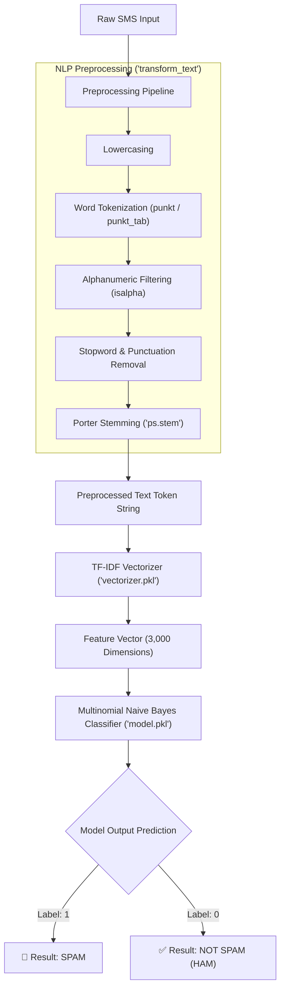

# 📩 SMS Spam Detection System

[](https://www.python.org/)
[](https://streamlit.io/)
[](https://scikit-learn.org/)
[](https://www.nltk.org/)
[](https://github.com/astral-sh/uv)
[]()
[](https://sms-spam-detection-7.streamlit.app/)

An end-to-end Natural Language Processing (NLP) and Machine Learning application designed to classify SMS messages into **Spam** or **Ham (Not Spam)** in real time. The solution integrates text preprocessing, TF-IDF feature extraction, a Multinomial Naive Bayes classifier, and an interactive web interface powered by Streamlit.

> 🚀 **Live Demo**: Experience the web application live at **[https://sms-spam-detection-7.streamlit.app/](https://sms-spam-detection-7.streamlit.app/)**

---

## 📑 Table of Contents

- [Live Demo](#-live-demo)
- [Overview](#-overview)
- [Key Features](#-key-features)
- [System Architecture & Pipeline](#-system-architecture--pipeline)
- [Repository Structure & File Analysis](#-repository-structure--file-analysis)
- [Machine Learning & NLP Details](#-machine-learning--nlp-details)
- [Getting Started](#-getting-started)
  - [Prerequisites](#prerequisites)
  - [Installation (Using `uv`)](#option-a-recommended-installation-using-uv)
  - [Installation (Using standard `pip`)](#option-b-standard-installation-using-pip-and-venv)
- [Running the Application](#-running-the-application)
- [Deployment](#-deployment)
- [Sample Test Cases](#-sample-test-cases)
- [Future Enhancements](#-future-enhancements)
- [License](#-license)

---

## 🔗 Live Demo

The application is deployed and publicly accessible online via Streamlit Community Cloud:

🌐 **[https://sms-spam-detection-7.streamlit.app/](https://sms-spam-detection-7.streamlit.app/)**

Test sample SMS messages directly from your browser with sub-second prediction response times—no local installation required!

---

## 🎯 Overview

Spam text messages are not only annoying but also present significant cybersecurity threats such as phishing, fraud, and identity theft. This project provides a lightweight, highly accurate, and low-latency solution to flag unsolicited and malicious SMS communications.

Using an optimized Natural Language Processing (NLP) pipeline, incoming text is normalized, filtered, and converted into high-dimensional vector representations. A pre-trained **Multinomial Naive Bayes** model predicts the message category with sub-second latency, accessible through an intuitive web application.

---

## ✨ Key Features

- **Robust NLP Preprocessing**: Multi-stage cleaning pipeline featuring case folding, punctuation removal, stopword filtering, and Porter stemming.
- **High-Performance Vectorization**: Feature extraction using TF-IDF (Term Frequency-Inverse Document Frequency) restricted to the top 3,000 most predictive n-grams.
- **Fast & Reliable Classification**: Built upon Multinomial Naive Bayes, providing fast, probabilistic, and memory-efficient inference.
- **Resource Caching**: Utilizes Streamlit's `@st.cache_resource` decorator to load serialized models into memory once, ensuring instantaneous subsequent predictions.
- **Cloud & Container Ready**: Contains platform-agnostic dependency definitions (`uv.lock`, `pyproject.toml`, `requirements.txt`) and `nltk.txt` for out-of-the-box hosting on Streamlit Community Cloud.
- **Interactive UI**: User-friendly web interface with live status notifications, validation warnings, and colored output banners.

---

## 🏗 System Architecture & Pipeline



---

## 📂 Repository Structure & File Analysis

```text
sms-spam-detection/
├── src/
│   └── sms_spam_detection/
│       └── __init__.py         # Package entrypoint boilerplate
├── .gitignore                  # Git tracking exclusion patterns
├── .python-version             # Target Python runtime declaration (3.12)
├── app.py                      # Main Streamlit web application & inference logic
├── model.pkl                   # Trained Multinomial Naive Bayes model artifact
├── nltk.txt                    # NLTK corpora specifications for cloud platforms
├── pyproject.toml              # Modern PEP 517/621 project configuration
├── README.md                   # Project documentation and user guide
├── requirements.txt            # Traditional pip dependency manifest
├── uv.lock                     # Deterministic lockfile for reproducible builds
└── vectorizer.pkl              # Pre-trained TF-IDF vectorizer artifact
```

### Comprehensive File Breakdown

| File Name | Purpose & Implementation Details |
| :--- | :--- |
| [`app.py`](app.py) | **Frontend & Inference Controller**: Implements the Streamlit UI, self-healing NLTK corpus downloads (`punkt`, `stopwords`, `punkt_tab`), the `transform_text()` cleaning function, resource caching for model assets, input validation, and asynchronous feedback banners. |
| [`model.pkl`](model.pkl) | **Trained Estimator Artifact**: Serialized `MultinomialNB` model trained on binary SMS classification (Ham: `0`, Spam: `1`). Evaluates conditional probabilities across word occurrences to deliver predictions. |
| [`vectorizer.pkl`](vectorizer.pkl) | **Feature Transformer**: Serialized `TfidfVectorizer` configured with `max_features=3000`. Converts cleaned token strings into numerical TF-IDF feature vectors aligned with the trained model. |
| [`nltk.txt`](nltk.txt) | **Cloud Build Manifest**: Instructs cloud providers (such as Streamlit Community Cloud) to automatically pre-download required NLTK packages (`punkt`, `punkt_tab`, `stopwords`) prior to launching the app. |
| [`pyproject.toml`](pyproject.toml) | **Standardized Metadata**: Declares project metadata, minimum Python compatibility (`>=3.12`), dependencies (`streamlit`, `scikit-learn`, `nltk`), and build system configs (`uv_build`). |
| [`requirements.txt`](requirements.txt) | **Pip Compatibility**: Plaintext dependency list for standard environments and legacy deployment pipelines. |
| [`uv.lock`](uv.lock) | **Deterministic Lockfile**: Locks down exact transitive dependency versions and hashes, ensuring 100% reproducible environments across operating systems. |
| [`.python-version`](.python-version) | **Environment Version Pin**: Instructs environment managers (`uv`, `pyenv`, `asdf`) to enforce Python `3.12`. |
| [`.gitignore`](.gitignore) | **Version Control Cleanliness**: Excludes Python bytecode caches (`__pycache__`, `*.pyc`), virtual environments (`.venv`), and build directories (`dist/`, `build/`). |
| [`src/sms_spam_detection/__init__.py`](src/sms_spam_detection/__init__.py) | **Module Namespace**: Marks the project as a structured Python package following standard `src/` layout best practices. |

---

## 🔬 Machine Learning & NLP Details

### 1. Natural Language Preprocessing
Text messages typically contain informal spelling, slangs, punctuation, and capitalization inconsistencies. The custom `transform_text` pipeline normalizes input through five stages:
1. **Case Normalization**: Transforms characters to lowercase to prevent identical words with different casings (e.g., `"FREE"` vs. `"free"`) from occupying distinct feature dimensions.
2. **Tokenization**: Uses NLTK's `word_tokenize` to segment text into discrete words and tokens.
3. **Punctuation & Character Cleaning**: Filters out non-alphabetic tokens using `.isalpha()`, removing extraneous symbols, numbers, and loose punctuation.
4. **Stopword Elimination**: Strips out frequent English words (e.g., `"the"`, `"is"`, `"at"`) using NLTK's standard English stopword list.
5. **Morphological Stemming**: Applies the Porter Stemming Algorithm (`PorterStemmer`) to map derived or inflected words down to their root form (e.g., `"running"`, `"runs"` $\to$ `"run"`).

### 2. Feature Extraction (TF-IDF)
The preprocessed text is transformed into numerical vectors using **TF-IDF (Term Frequency-Inverse Document Frequency)**:
$$\text{TF-IDF}(t, d, D) = \text{TF}(t, d) \times \log\left(\frac{1 + |D|}{1 + |\{d \in D : t \in d\}|}\right) + 1$$
- **Vocabulary Size**: Configured to capture the top **3,000 most informative features** (`max_features=3000`), balancing predictive power with low memory footprint and high inference throughput.

### 3. Classification Algorithm (Multinomial Naive Bayes)
The core classifier is **Multinomial Naive Bayes (`MultinomialNB`)**:
- Applies Bayes' Theorem under the conditional independence assumption between feature dimensions.
- Extremely well-suited for text categorization tasks involving discrete feature representations like TF-IDF or bag-of-words.
- Offers exceptional inference speed, making it suitable for real-time applications.

---

## 🚀 Getting Started

### Prerequisites
- **Python**: Version `3.12` or higher installed.
- **Git**: Installed for version control cloning.

Clone the repository:
```bash
git clone <your-repository-url>
cd sms-spam-detection
```

---

### Option A: (Recommended) Installation Using `uv`

[`uv`](https://github.com/astral-sh/uv) is an extremely fast Python package and project manager written in Rust.

1. **Install `uv`** (if not already installed):
   ```bash
   # Windows (PowerShell)
   powershell -ExecutionPolicy ByPass -c "irm https://astral.sh/uv/install.ps1 | iex"

   # macOS / Linux
   curl -LsSf https://astral.sh/uv/install.sh | sh
   ```

2. **Sync the project environment**:
   ```bash
   uv sync
   ```
   This automatically creates a virtual environment (`.venv`) and installs all pinned dependencies from `uv.lock`.

---

### Option B: Standard Installation Using `pip` and `venv`

If you prefer using standard Python tools:

1. **Create and activate a virtual environment**:
   ```bash
   # Windows
   python -m venv .venv
   .venv\Scripts\activate

   # macOS / Linux
   python3 -m venv .venv
   source .venv/bin/activate
   ```

2. **Install dependencies**:
   ```bash
   pip install --upgrade pip
   pip install -r requirements.txt
   ```

---

## 🖥 Running the Application

Launch the Streamlit interface using:

```bash
# When using uv:
uv run streamlit run app.py

# Or when using activated venv:
streamlit run app.py
```

Once executed, open your web browser and navigate to:
```text
Local URL:    http://localhost:8501
Network URL:  http://<your-network-ip>:8501
```

---

## 🌐 Deployment

### Production Deployment

The project is currently hosted live at:
🔗 **[https://sms-spam-detection-7.streamlit.app/](https://sms-spam-detection-7.streamlit.app/)**

### Deploying Your Own Instance to Streamlit Community Cloud

This project is pre-configured for seamless one-click deployment on [Streamlit Community Cloud](https://streamlit.io/cloud):

1. Push this repository to **GitHub**.
2. Visit [share.streamlit.io](https://share.streamlit.io) and sign in.
3. Click **"New App"** and select:
   - **Repository**: `<your-github-username>/sms-spam-detection`
   - **Branch**: `main`
   - **Main file path**: `app.py`
4. The deployment engine will automatically recognize:
   - [`requirements.txt`](requirements.txt) to install Python libraries.
   - [`nltk.txt`](nltk.txt) to download required NLTK corpora.
5. Click **Deploy!**

---

## 🧪 Sample Test Cases

You can test the deployed application using the following sample messages:

| Test Message | Expected Output | Rationale |
| :--- | :---: | :--- |
| `"WINNER!! As a valued customer you have been selected to receive a £900 prize reward! Call 09061701461 now!"` | 🚨 **Spam** | High density of promotional and urgency triggers (`prize`, `reward`, `call now`). |
| `"Free entry in 2 a weekly competition to win FA Cup final tkts 21st May 2005. Text FA to 87121."` | 🚨 **Spam** | Unsolicited competition and shortcode subscription trigger. |
| `"Hey, are we still meeting up for lunch today at 1 PM?"` | ✅ **Not Spam** | Conversational message without commercial or suspicious keywords. |
| `"Can you please send me the class notes from yesterday's lecture?"` | ✅ **Not Spam** | Contextual inquiry with normal sentence structure. |

---

## 🔮 Future Enhancements

- [ ] **Confidence Score Display**: Expose `model.predict_proba()` to visualize prediction probability and model confidence meters.
- [ ] **Spam Keyword Highlighting**: Visually highlight the specific keywords in the message that contributed most to the spam classification score.
- [ ] **REST API Endpoint**: Add a FastAPI or Flask microservice endpoint for headless programmatic integration into mobile apps or SMS gateways.
- [ ] **Model Comparison**: Experiment with ensemble models (Random Forest, XGBoost) and Transformer-based models (DistilBERT) for benchmark comparison.
- [ ] **Batch Processing**: Allow users to upload CSV/Excel files to classify thousands of messages simultaneously.

---

## 📄 License

This project is released under the [MIT License](LICENSE) (or open-source license of your choice). Feel free to use, modify, and distribute it for personal, academic, or commercial purposes.
